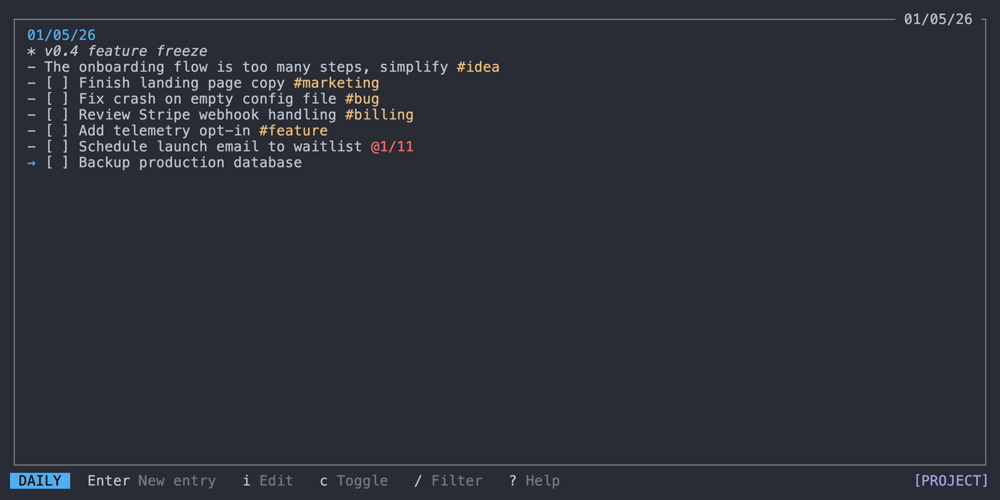
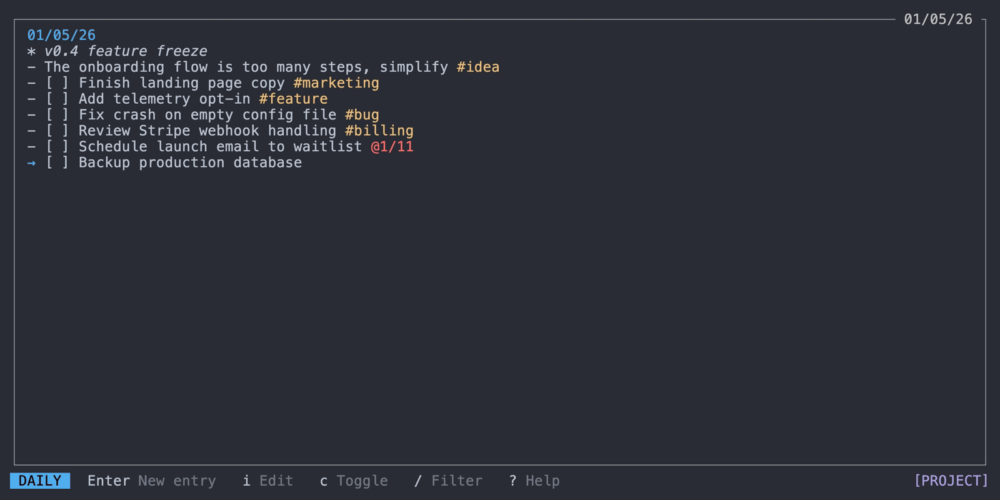
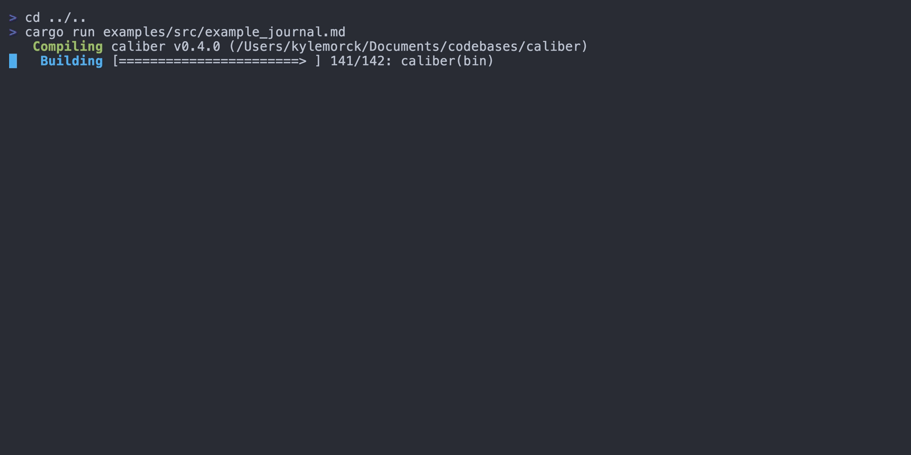

<!-- AUTO-GENERATED FILE. DO NOT EDIT DIRECTLY. Edit /docs/templates/README.template.md instead. -->

# Corner

A terminal-based task journal for developers. Capture ideas without leaving your workflow, find them when you need them.


- **Keyboard-driven** — Vim-style navigation that feels natural in the terminal
- **Zero-friction capture** — Press enter and start typing, organize later or don't
- **Project and hub journals** — Keep a journal per repo plus one that follows you everywhere
- **Schedule forward** — Tag a task with a future date and it surfaces when that day comes
- **Filter everything** — Search your entire history by tags, dates, or text
- **Plain markdown** — Commit it, edit it anywhere, let AI agents read it for context

## Why Corner?

If you live in the terminal, context-switching to a GUI app just to jot down a task breaks your flow. Corner lives where you work.

Tab over, press enter, start typing. That's it. No forms, no fields, no friction.

Keep a journal per project and a hub journal that follows you everywhere. When you're deep in a repo and remember you need to pay a bill, one keystroke switches context. No need to organize your task manager around your projects — the structure is already there.

Tasks and notes stay where you wrote them. When you want to review what's open, filter across your entire history by tags, dates, or text. When you don't have time to organize, don't. Things surface when you need them.

Your journal is a plain markdown file. Commit it to your repo, read it on your phone, edit it in another app, let your AI coding agent read it for context. No lock-in.

## Installation

**Homebrew (macOS/Linux)**
```bash
brew install bantamhq/tap/corner
```

**Shell (macOS/Linux)**
```bash
curl --proto '=https' --tlsv1.2 -sSf https://github.com/bantamhq/corner/releases/latest/download/corner-installer.sh | sh
```

**Cargo**
```bash
cargo install corner
```

**Manual**

Download the latest binary for your platform from [Releases](https://github.com/bantamhq/corner/releases).

## Quick Start

```bash
corner                   # Open your journal
```

Launch Corner in a git repository and it will auto-init a project journal (configurable). Otherwise, you'll start in your hub journal.

**The basics:**

| Key | Action |
|-----|--------|
| `Enter` | Add a new entry |
| `↓` / `↑` or `j` / `k` | Move up and down |
| `←` / `→` or `h` / `l` | Previous / next day |
| `Shift+Tab` | Cycle type: task → note → event |
| `/` | Open filter |
| `` ` `` | Toggle between project and hub journal |
| `q` | Command palette |
| `.` | Calendar sidebar |
| `,` | Agenda panel |

**Entry types:**

```markdown
- [ ] A task
- [x] A completed task
- A note
* An event
```

That's enough to get started. The sections below go deeper.

## Daily View



Your home base. Each day is a page in your journal. Navigate between days with `h` / `l` or arrow keys, or jump to any date with `\` to open the date picker.

Recurring entries (`@every-*`) from other days appear at the top when their schedule matches today.

| Key | Action |
|-----|--------|
| `←` / `→` or `h` / `l` | Previous / next day |
| `[` / `]` | Previous / next month |
| `t` | Jump to today |
| `\` | Open date picker |
| `Enter` | New entry at end |
| `o` / `O` | New entry below / above cursor |
| `i` | Edit selected entry |
| `d` | Delete entry |
| `Space` | Toggle task completion |
| `z` | Hide / show completed tasks |
| `s` | Tidy entries by type |
| `T` | Move entry to today |

### Date Picker


Press `\` to open a calendar for quick navigation. Days with entries are highlighted. Navigate with arrow keys or `h/j/k/l`, switch months with `[` and `]`, and press `Enter` to jump to the selected date. Use `{` and `}` to navigate years.

## Filtering



Press `/` to search across your entire journal. Filter by entry type, tags, dates, or text — and combine them.

**Examples:**

| Query | Result |
|-------|--------|
| `!tasks` | All incomplete tasks |
| `#work` | Entries tagged #work |
| `!tasks #work` | Incomplete tasks tagged #work |
| `1/15..1/20` | Entries between Jan 15 and Jan 20 |
| `@recurring` | All recurring entries |
| `meeting #standup` | Entries containing "meeting" with #standup tag |
| `-#work` | Entries without #work tag |

Edit, toggle, or delete entries directly from filter results. Press `Enter` to quick-add a new entry to today without leaving the filter view.

### Date Ranges

Use spread syntax for date ranges:

- `1/15` — Exact date
- `1/15..` — From date to today
- `..1/15` — All past through date
- `1/15..1/20` — Between two dates

Dates default to past (most useful for searching history). Use relative dates like `today`, `yesterday`, `mon`, `d7` (7 days ago), or `d7+` (7 days from now).

### Combining Filters

- Filters combine with AND: `!tasks #work meeting` finds incomplete tasks tagged #work containing "meeting"
- Entry type filters combine with OR: `!tasks !notes` shows both tasks and notes
- Negative filters exclude: `-#work -#personal` excludes entries with either tag

## Task Management


### Selection Mode

Press `v` to enter selection mode for batch operations. Select multiple entries, then act on all of them at once.

| Key | Action |
|-----|--------|
| `v` | Toggle selection on current entry |
| `V` | Select range from last selection to cursor |
| `d` | Delete all selected |
| `Space` | Toggle completion on all selected |
| `y` | Yank (copy) all selected |
| `Esc` | Exit selection mode |

### Clipboard

`y` copies the selected entry (or entries in selection mode) to your system clipboard. `p` pastes clipboard content as new entries below the cursor — multi-line paste creates multiple entries.

### Tags

Add tags anywhere in an entry with `#tagname`. Tags must start with a letter and may include letters, digits, `_`, or `-`. Remove the last tag from an entry with `x`, or all tags with `X`.

### Recurring Entries

Use `@every-*` patterns for entries that repeat on a schedule:

```markdown
- [ ] Daily standup @every-day
- [ ] Weekly review @every-monday
- [ ] Pay rent @every-1
```

Available patterns:

| Pattern | Recurrence |
|---------|------------|
| `@every-day` | Every day |
| `@every-weekday` | Monday through Friday |
| `@every-mon` through `@every-sun` | Weekly on that day |
| `@every-1` through `@every-31` | Monthly on that date |

Recurring entries appear on all matching days. When you complete one, a copy is marked done for today while the source entry stays open for future occurrences.

To edit or delete a recurring entry, press `o` to jump to its source.

### Moving & Deferring

Move entries between days to reschedule:

| Key | Action |
|-----|--------|
| `T` | Move entry to today |
| `>` | Defer entry to tomorrow |

Defer is useful for tasks you didn't get to today. If `defer_skip_weekends = true` in your config, deferring on Friday or Saturday moves the entry to Monday instead.

### Undo / Redo

Most actions can be undone with `u` and redone with `U`. Undo history clears when you navigate to a different day, filter, or journal.

## Project Registry

Corner maintains a project registry at `~/.config/corner/projects.toml` used by the command palette.
You can hide a project from the palette via `hide_from_registry = true` in the project config.

## Command Palette

Press `q` to open the command palette. It provides access to commands, projects, and tags in a single searchable interface. The palette is self-documented — each item shows its description inline.

## Sidebars

Corner has two optional sidebars that can be toggled on and off:

- **Calendar sidebar** (`.`) — Shows a monthly calendar with days that have entries highlighted. Useful for navigating to specific dates.
- **Agenda panel** (`,`) — Shows upcoming events from connected calendars (see Calendar Integration below).

Configure which sidebar opens on launch with `sidebar_default` in your config:

```toml
# Options: "none", "agenda", "calendar" (default)
sidebar_default = "calendar"
```

## Calendar Integration

Corner can display events from external ICS calendar feeds in the agenda panel. Events appear alongside your journal entries, giving you a unified view of your day.

### Setup

Add calendar sources to your base `config.toml` (not project configs, for security):

```toml
[calendars.work]
url = "https://calendar.example.com/work.ics"
enabled = true
color = "blue"  # Optional: red, green, yellow, blue, magenta, cyan, etc.

[calendars.personal]
url = "https://calendar.example.com/personal.ics"
enabled = true
```

### Visibility Options

```toml
[calendar_visibility]
# "all" shows all calendars by default, "none" hides them
default_mode = "all"
# Show cancelled events (with strikethrough)
display_cancelled = false
# Show declined events (with strikethrough)
display_declined = false
```

### Usage

- Press `,` to toggle the agenda panel showing today's events
- Events are read-only — they sync from your calendar feeds
- Colors help distinguish between different calendars

## Favorite Tags



Slots `1-9` give you quick access to commonly-used tags.

| Key | Action |
|-----|--------|
| `1-9` | Filter by favorite tag |
| `Shift+1-9` | Append favorite tag to selected entry |
| `#1-9` (in edit mode) | Expand to favorite tag name |

Configure your favorites in `config.toml`:

```toml
[favorite_tags]
1 = "feature"
2 = "bug"
3 = "idea"
4 = "next"
```

**Example workflow:** Filter all open tasks with `/!tasks`, enter selection mode with `v`, select what you want to work on today, press `Shift+4` to tag them all with `#next`.

## Saved Filters

Define reusable filter queries in your config, then use `$name` to expand them.

```toml
[filters]
t = "!tasks"
n = "!notes"
next = "!tasks #next"
stale = "!tasks ..d7"  # Tasks from 7+ days ago
```

Now `/$next` expands to `!tasks #next`. Combine them: `$t #work` expands to `!tasks #work`.

## Keyboard Reference

### Navigation

| Key | Action |
|-----|--------|
| ↑/↓ | Move selection up/down |
| ←/→ | Navigate to previous/next day |
| `g` / `G` | Jump to first/last entry |
| `K` / `J` | Jump backward/forward one week |
| `[` / `]` | Jump backward/forward one month |
| `{` / `}` | Jump backward/forward one year |
| `t` | Jump to today |
| `\` | Open date picker |


### Entry Operations

| Key | Action |
|-----|--------|
| `o` / `O` | Create new entry below/above |
| `i` | Edit selected entry |
| Space | Toggle task completion |
| `d` | Delete selected entry |
| `T` / `>` | Bring to today / Defer to tomorrow |
| Shift+Tab | Cycle entry type (task/note/event) |


### Clipboard & Undo

| Key | Action |
|-----|--------|
| `y` / `p` | Yank/paste entry |
| `u` / `U` | Undo/redo last action |


### Tags

| Key | Action |
|-----|--------|
| `x` | Remove last tag from entry |
| `X` | Remove all tags from entry |


### Views & Panels

| Key | Action |
|-----|--------|
| Tab | Toggle between daily and filter view |
| `/` | Open filter prompt |
| ``` | Toggle between hub and project journal |
| `c` | Toggle combined view (all journals) |
| `.` | Toggle calendar sidebar |
| `,` | Toggle agenda panel |


### Daily Mode

| Key | Action |
|-----|--------|
| `r` | Enter reorder mode |
| `s` | Tidy entries (sort by type) |
| `z` | Hide completed tasks |


### Filter Mode

| Key | Action |
|-----|--------|
| Enter | Add new entry |
| `r` | Refresh filter results |


### Edit Mode

| Key | Action |
|-----|--------|
| Enter | Save and exit edit mode |
| Esc | Cancel and discard changes |
| ↓ | Save and create new entry below |
| Tab | Autocomplete tags and dates |


### Selection Mode

| Key | Action |
|-----|--------|
| `v` | Enter/exit selection mode |
| `V` | Extend selection as range |


### General

| Key | Action |
|-----|--------|
| `q` | Open command palette |
| Ctrl+`q` | Quit application |


### Filter Syntax

| Pattern | Matches |
|---------|---------|
| `!tasks` | Incomplete tasks |
| `!completed` | Completed tasks |
| `!notes` | Notes only |
| `!events` | Events only |
| `#tag` | Entries with tag |
| `$name` | Saved filter |
| `word` | Entries containing text |
| `mm/dd` | Entries on exact date |
| `mm/dd..` | From date to today |
| `..mm/dd` | All past through date |
| `mm/dd..mm/dd` | Between two dates |
| `@recurring` | Show recurring entries (hidden by default) |
| `-#tag` | Entries without tag |
| `-!type` | Exclude entry type |
| `-word` | Entries not containing text |

### Date Syntax

| Pattern | Matches |
|---------|---------|
| Dates | `MM/DD`, `MM/DD/YY`, `MM/DD/YYYY`, `YYYY/MM/DD` |
| Relative | `today`, `tomorrow`, `yesterday`, `[mon-sun]`, `d[1-999]` (+/- for direction) |
| Recurring (entries) | `@every-[mon-sun]`, `@every-[1-31]`, `@every-day`, `@every-weekday` |

## Journal Format

Corner uses a markdown-compatible format:

```markdown
# 2025/01/15
- [ ] Incomplete task
- [x] Completed task
- A note
* An event

# 2025/01/16
- [ ] Follow up on review
- Meeting notes from standup #daily
```

Empty days are automatically removed. Non-entry lines (headers, blank lines, raw text) are preserved.

## Configuration

Config file: `~/.config/corner/config.toml`

Run `corner init` to create an empty config file. Configuration is optional — Corner works out of the box with sensible defaults.

```toml
# Custom hub journal path (default: ~/.config/corner/hub_journal.md)
hub_file = "/path/to/journal.md"

# Custom scratchpad path (default: ~/.config/corner/scratchpad.md)
scratchpad_file = "~/notes/scratchpad.md"

# Start with completed tasks hidden (default: false)
hide_completed = false

# Custom tidy order for 's' command (default shown)
# Options: completed, uncompleted, notes, events
tidy_order = ["completed", "events", "notes", "uncompleted"]

# Date format in header (default: "%A, %b %-d" e.g. "Monday, Jan 5")
header_date_format = "%A, %b %-d"

# Default filter when pressing '/' (default: "!tasks")
default_filter = "!tasks"

# Auto-create project journal when opening Corner in a git repo (default: true)
auto_init_project = true

# Skip weekends when deferring with '>' (defer Friday → Monday) (default: false)
defer_skip_weekends = false

# Hide footer key hints (default: false)
hide_footer_help = false

# Default sidebar on launch: "none", "agenda", or "calendar" (default: "calendar")
sidebar_default = "calendar"

# Favorite tags - press 1-9 to filter, Shift+1-9 to append, #1-9 to expand
[favorite_tags]
1 = "feature"
2 = "bug"
3 = "idea"

# Saved filters - use $name in filter queries to expand
[filters]
t = "!tasks"
n = "!notes"
e = "!events"
```

### Project Configuration

Project config at `.corner/config.toml` overlays the base config — project values override matching keys, while unset options inherit from your base `config.toml`. Similarly, `hub_config.toml` can override settings specifically for your hub journal.

Project-specific options:

```toml
# Custom journal path for this project (default: .corner/journal.md)
journal_file = ".corner/journal.md"

# Hide this project from the command palette
hide_from_registry = false
```

When you launch Corner in a git repository, it will offer to create a project journal for you. If you declined or want to create one outside a git repo, run `corner init project`.

### Key Remapping

Remap keys per context using `[keys.<context>]`:

```toml
[keys.daily_normal]
move_down = "n"
move_up = "e"

[keys.edit]
submit = "C-s"
```

Defining any key for an action disables its defaults. Valid contexts: `daily_normal`, `filter_normal`, `edit`, `reorder`, `selection`, `command_palette`.

## License

MIT
